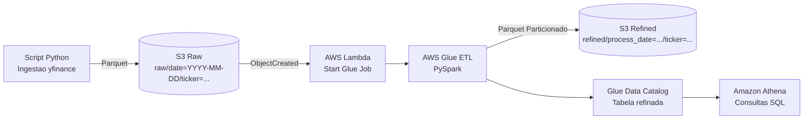

# FIAP Tech Challenge Fase 2

Pipeline batch para ingestao, transformacao e consulta de dados de mercado financeiro (B3) usando AWS.

## 1. Resumo Executivo
Este projeto implementa um pipeline de dados orientado a eventos para:
- coletar dados diarios de ativos via `yfinance`;
- armazenar dados brutos em Parquet no Amazon S3 (`raw/`);
- disparar processamento ETL no AWS Glue via evento de upload no S3;
- publicar camada refinada em Parquet particionada para consulta;
- disponibilizar analise SQL no Amazon Athena.

Resultado: arquitetura simples, auditavel e aderente aos requisitos do desafio, com separacao clara entre ingestao, orquestracao e transformacao.

## 2. Objetivo do Desafio
Atender ao enunciado do PDF `Tech_Challenge_Fase_2_Requisitos.pdf`, cobrindo ponta a ponta:
- ingestao diaria;
- armazenamento particionado em S3;
- gatilho por evento;
- Lambda iniciando Glue Job;
- ETL com regras obrigatorias;
- publicacao refinada;
- catalogacao no Glue Data Catalog;
- consulta no Athena.

## 2.1 Escopo desta entrega
Arquitetura implementada e apresentada neste projeto:
- Script Bovespa (ingestao sob demanda);
- S3 Raw (bucket Bovespa);
- Lambda para trigger do Glue;
- Glue ETL Bovespa;
- S3 Refined;
- Athena para consulta.

## 3. Arquitetura da Solucao



### 3.1 Fluxo operacional
1. O script local executa a coleta dos tickers e grava Parquet no prefixo `raw/`.
2. O evento `ObjectCreated` do S3 aciona a Lambda.
3. A Lambda extrai a data da `key` e executa `glue:StartJobRun`.
4. O Glue processa os dados e grava a camada `refined/` com particoes.
5. O catalogo e atualizado (via crawler).
6. O Athena consulta a tabela refinada com filtro de particao.

## 4. Componentes do Projeto

### 4.1 Codigo versionado
- Script de ingestao: [app/ingest_bovespa.py](C:/Users/rafaeltegazzini/Documents/Pessoais/fiap-tech-challenge-fase2/app/ingest_bovespa.py)
- Dependencias: [pyproject.toml](C:/Users/rafaeltegazzini/Documents/Pessoais/fiap-tech-challenge-fase2/pyproject.toml)

### 4.2 Servicos AWS utilizados
- Amazon S3 (camadas `raw/`, `refined/` e saida de consultas do Athena)
- AWS Lambda (orquestracao do Glue)
- AWS Glue (ETL e catalogacao)
- AWS Glue Data Catalog (metadados)
- Amazon Athena (consulta analitica)
- IAM + CloudWatch Logs (seguranca e observabilidade)

## 5. Estrutura de Dados no S3

### 5.1 Camada bruta (`raw`)
Padrao de escrita usado no projeto:

```text
s3://bovespa-data/raw/date=YYYY-MM-DD/ticker=XXXX/dados.parquet
```

### 5.2 Camada refinada (`refined`)
Padrao de saida do ETL:

```text
s3://bovespa-data/refined/process_date=YYYY-MM-DD/ticker=XXXX/part-*.parquet
```

Observacao: o enunciado cita `dt`. Nesta implementacao foi adotado `date/process_date` mantendo a mesma estrategia de particionamento por data + ticker.

## 6. Regras de Transformacao (Glue ETL)
O job ETL aplica as transformacoes exigidas no desafio:
- agregacao/sumarizacao por ticker (contagem, volume total, maximo, minimo);
- renomeacao de colunas:
  - `open` -> `opening_price`
  - `close` -> `closing_price`
- calculos temporais e derivacoes:
  - `price_range = high - low`
  - `daily_return = closing_price - opening_price`
  - media movel de 3 periodos (`moving_avg_3`) por ticker ordenado por data.

## 7. Aderencia aos Requisitos do PDF

| Requisito | Como foi atendido |
|---|---|
| 1. Ingestao diaria | Script Python com `yfinance` para coleta de series diarias |
| 2. Raw no S3 particionado | Escrita Parquet no prefixo `raw/` com particao por data e ticker |
| 3. Gatilho S3 | Evento `ObjectCreated` no prefixo `raw/` |
| 4. Lambda inicia Glue | Lambda faz apenas `StartJobRun` do Glue |
| 5. ETL com 3 transformacoes | Agregacao, renomeacao e calculo temporal no Glue |
| 6. Saida refinada | Parquet em `refined/` com particoes por data e ticker |
| 7. Catalogo | Tabela registrada/atualizada no Glue Data Catalog |
| 8. Consulta SQL | Athena consultando tabela refinada com filtro de particao |

## 8. Execucao do Projeto

### 8.1 Pre-requisitos
- Python 3.13+
- Credenciais AWS configuradas (`aws configure`)
- Bucket S3 criado (ex.: `bovespa-data`)
- Permissoes IAM para S3, Glue, Lambda e Athena

### 8.2 Instalar dependencias
```bash
pip install boto3 pandas pyarrow yfinance
```

### 8.3 Executar ingestao local
```bash
python app/ingest_bovespa.py
```

### 8.4 Validar processamento na AWS
1. Confirmar arquivo no `raw/`.
2. Confirmar disparo da Lambda no CloudWatch.
3. Confirmar execucao do Glue Job.
4. Confirmar gravacao no `refined/`.
5. Confirmar tabela no Glue Data Catalog.
6. Executar query no Athena.

## 9. Consultas de Exemplo (Athena)

```sql
SELECT *
FROM "AwsDataCatalog"."bovespa_db"."refined"
WHERE process_date = '2026-03-23'
LIMIT 10;
```

```sql
SELECT
  ticker,
  process_date,
  date,
  opening_price,
  closing_price,
  price_range,
  daily_return,
  moving_avg_3,
  volume
FROM "AwsDataCatalog"."bovespa_db"."refined"
WHERE process_date = '2026-03-23'
ORDER BY ticker, date DESC;
```

## 10. Seguranca e Governanca
Boas praticas adotadas:
- separacao de roles IAM por servico (Lambda e Glue);
- principio do menor privilegio (escopo por bucket/prefixo);
- logging centralizado no CloudWatch;
- particionamento para eficiencia de custo e performance no Athena.

## 11. Evidencias para Apresentacao
Checklist objetivo para demonstracao:
- [✅] arquivo Parquet em `raw/date=.../ticker=.../`
- [✅] evento S3 configurado para a Lambda
- [✅] log da Lambda com `StartJobRun`
- [✅] job Glue com transformacoes obrigatorias
- [✅] arquivo Parquet em `refined/process_date=.../ticker=.../`
- [✅] tabela no Glue Data Catalog
- [✅] query no Athena com resultado retornado

## 13. Configurando o ambiente AWS
### Usuário IAM
Criei um usuário IAM `techchallenge-dev` com policy que o usuário crie e gerencie recursos necessários para o pipeline, como buckets S3, funções Lambda, jobs Glue e consultas Athena. O ideal em produção seria restringir os recursos específicos, mas para desenvolvimento e testes, o acesso amplo pode ser mais prático, ajudando em ambientes de aprendizado. A partir desse usuário foram geradas as chaves de acesso para configurar o AWS CLI e permitir que o script de ingestão e outros componentes interajam com os serviços AWS.
policy: policy-fiap-tech-challenge-2
```json
{
    "Version": "2012-10-17",
    "Statement": [
        {
            "Sid": "S3ProjectAccess",
            "Effect": "Allow",
            "Action": [
                "s3:CreateBucket",
                "s3:ListAllMyBuckets",
                "s3:ListBucket",
                "s3:GetBucketLocation",
                "s3:GetBucketNotification",
                "s3:PutBucketNotification",
                "s3:GetBucketPolicy",
                "s3:PutBucketPolicy",
                "s3:GetBucketAcl",
                "s3:PutBucketAcl",
                "s3:GetObject",
                "s3:PutObject",
                "s3:DeleteObject"
            ],
            "Resource": "*"
        },
        {
            "Sid": "LambdaProjectAccess",
            "Effect": "Allow",
            "Action": [
                "lambda:CreateFunction",
                "lambda:GetFunction",
                "lambda:UpdateFunctionCode",
                "lambda:UpdateFunctionConfiguration",
                "lambda:InvokeFunction",
                "lambda:AddPermission",
                "lambda:RemovePermission",
                "lambda:CreateEventSourceMapping",
                "lambda:DeleteFunction",
                "lambda:ListFunctions",
                "lambda:GetPolicy"
            ],
            "Resource": "*"
        },
        {
            "Sid": "GlueProjectAccess",
            "Effect": "Allow",
            "Action": [
                "glue:CreateJob",
                "glue:UpdateJob",
                "glue:GetJob",
                "glue:StartJobRun",
                "glue:GetJobRun",
                "glue:GetJobRuns",
                "glue:BatchStopJobRun",
                "glue:CreateCrawler",
                "glue:UpdateCrawler",
                "glue:StartCrawler",
                "glue:StopCrawler",
                "glue:GetCrawler",
                "glue:GetCrawlers",
                "glue:CreateDatabase",
                "glue:GetDatabase",
                "glue:GetDatabases",
                "glue:CreateTable",
                "glue:GetTable",
                "glue:GetTables",
                "glue:UpdateTable",
                "glue:DeleteTable"
            ],
            "Resource": "*"
        },
        {
            "Sid": "AthenaProjectAccess",
            "Effect": "Allow",
            "Action": [
                "athena:StartQueryExecution",
                "athena:GetQueryExecution",
                "athena:GetQueryResults",
                "athena:StopQueryExecution",
                "athena:ListWorkGroups",
                "athena:GetWorkGroup"
            ],
            "Resource": "*"
        },
        {
            "Sid": "GlueCatalogAndLogsAccess",
            "Effect": "Allow",
            "Action": [
                "logs:CreateLogGroup",
                "logs:CreateLogStream",
                "logs:PutLogEvents",
                "logs:DescribeLogGroups",
                "logs:DescribeLogStreams",
                "cloudwatch:PutMetricData"
            ],
            "Resource": "*"
        },
        {
            "Sid": "AllowRoleManagementForProject",
            "Effect": "Allow",
            "Action": [
                "iam:CreateRole",
                "iam:GetRole",
                "iam:PassRole",
                "iam:AttachRolePolicy",
                "iam:PutRolePolicy",
                "iam:UpdateAssumeRolePolicy",
                "iam:TagRole"
            ],
            "Resource": "*"
        },
        {
            "Sid": "IAMConsoleReadAccess",
            "Effect": "Allow",
            "Action": [
                "iam:ListUsers",
                "iam:GetUser",
                "iam:ListRoles",
                "iam:GetRole",
                "iam:ListPolicies",
                "iam:GetPolicy",
                "iam:GetPolicyVersion",
                "iam:ListAttachedUserPolicies",
                "iam:ListAttachedRolePolicies",
                "iam:ListRolePolicies",
                "iam:ListUserPolicies",
                "iam:GetAccountSummary",
                "iam:ListMFADevices",
                "iam:ListInstanceProfiles",
                "iam:ListOpenIDConnectProviders",
                "iam:ListSAMLProviders",
                "iam:GenerateServiceLastAccessedDetails",
                "iam:GetServiceLastAccessedDetails"
            ],
            "Resource": "*"
        }
    ]
}
```

### Role e Policy Lambda
Criei uma role `LabRole-Lambda-TechChallenge` para a função Lambda, com a seguinte policy:LambdaStartGlueJobPolicy
```json
{
  "Version": "2012-10-17",
  "Statement": [
    {
      "Sid": "StartSpecificGlueJob",
      "Effect": "Allow",
      "Action": [
        "glue:StartJobRun",
        "glue:GetJob",
        "glue:GetJobRun",
        "glue:GetJobRuns"
      ],
      "Resource": "*"
    }
  ]
}
```

### Role e Policy Glue
Criei uma role `LabRole-Glue-TechChallenge` para o job Glue, com a seguinte policy:GlueS3BovespaDataAccessPolicy
```json
{
  "Version": "2012-10-17",
  "Statement": [
    {
      "Sid": "ListBucketAccess",
      "Effect": "Allow",
      "Action": [
        "s3:ListBucket",
        "s3:GetBucketLocation"
      ],
      "Resource": "arn:aws:s3:::bovespa-data"
    },
    {
      "Sid": "ReadRawWriteRefinedAndAthenaResults",
      "Effect": "Allow",
      "Action": [
        "s3:GetObject",
        "s3:PutObject",
        "s3:DeleteObject"
      ],
      "Resource": [
        "arn:aws:s3:::bovespa-data/raw/*",
        "arn:aws:s3:::bovespa-data/refined/*",
        "arn:aws:s3:::bovespa-data/athena-results/*"
      ]
    }
  ]
}
```
