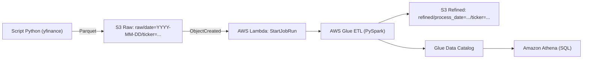

# Apresentacao do Projeto (ate 10 minutos)

## 1) Objetivo da apresentacao
Entregar uma apresentacao curta, clara e aderente ao escopo do projeto de pipeline batch B3 na AWS, cobrindo todos os requisitos do desafio e evidenciando o fluxo ponta a ponta.

## 2) Arquitetura da narrativa (10 minutos)
Use esta ordem para manter a banca alinhada:

1. Contexto e problema (por que esse pipeline existe).
2. Arquitetura fim a fim (como os servicos se conectam).
3. Fluxo operacional com evidencias (o que acontece em execucao real).
4. Transformacoes obrigatorias do ETL (o coracao tecnico do desafio).
5. Aderencia formal aos 8 requisitos (checklist final).
6. Fechamento com ganhos e proximos passos.

## 3) Distribuicao de tempo por slide

| Slide | Tempo | Tema |
|---|---:|---|
| 1 | 0:40 | Abertura e objetivo |
| 2 | 1:10 | Escopo e servicos AWS usados |
| 3 | 1:20 | Arquitetura fim a fim |
| 4 | 1:30 | Fluxo operacional (raw -> trigger -> ETL -> refined) |
| 5 | 1:30 | Transformacoes obrigatorias no Glue |
| 6 | 1:10 | Catalogo e consultas Athena |
| 7 | 1:20 | Aderencia aos 8 requisitos do desafio |
| 8 | 0:20 | Encerramento |
| **Total** | **9:00** | **+1:00 de margem para perguntas** |

## 4) Conteudo recomendado de cada slide + fala sugerida

## Slide 1 - Abertura e objetivo (0:40)
**Tela:**
- Nome do projeto: FIAP Tech Challenge Fase 2
- Frase: "Pipeline batch para ingestao, transformacao e consulta de dados de mercado financeiro (B3) usando AWS"

**Fala sugerida:**
"Nesta entrega eu implementei um pipeline batch de dados de mercado financeiro, cobrindo ingestao, processamento e consulta analitica na AWS. O foco foi atender integralmente os requisitos do desafio com arquitetura simples, auditavel e orientada a evento."

## Slide 2 - Escopo e stack do projeto (1:10)
**Tela:**
- Ingestao: `app/ingest_bovespa.py` com `yfinance`
- Armazenamento: S3 (`raw/` e `refined/`)
- Orquestracao: S3 Event + Lambda
- Processamento: AWS Glue (PySpark)
- Consulta: Glue Data Catalog + Athena

**Fala sugerida:**
"O escopo implementado e: script de ingestao, camada raw no S3, gatilho por evento no S3, Lambda iniciando Glue Job, ETL com transformacoes obrigatorias, saida refinada em Parquet particionado, catalogo no Glue e consultas SQL no Athena."

## Slide 3 - Arquitetura fim a fim (1:20)
**Tela (diagrama):**



**Fala sugerida:**
"A arquitetura e orientada a eventos: assim que o arquivo bruto entra no prefixo raw, a Lambda dispara o Glue Job. O Glue transforma e publica no refined, atualiza metadados no catalogo e, por fim, o Athena consulta com SQL. Isso separa claramente ingestao, orquestracao e transformacao."

## Slide 4 - Fluxo operacional com evidencias (1:30)
**Tela:**
1. Script baixa dados diarios (ex.: `PETR4.SA`, `VALE3.SA`, `ITUB4.SA`)
2. Upload Parquet para `raw/date=.../ticker=.../dados.parquet`
3. Evento S3 `ObjectCreated` aciona Lambda
4. Lambda chama `glue:StartJobRun` com `--source_bucket` e `--process_date`
5. Glue grava `refined/process_date=.../ticker=.../part-*.parquet`

**Fala sugerida:**
"No script de ingestao, os dados sao baixados do yfinance, padronizados e enviados em Parquet para a camada raw particionada por data e ticker. Esse upload aciona a Lambda, que apenas orquestra e inicia o Glue Job com os argumentos de processamento. O resultado final sai no refined, tambem particionado."

## Slide 5 - Transformacoes obrigatorias no Glue (1:30)
**Tela:**
- Renomeacao:
  - `open -> opening_price`
  - `close -> closing_price`
- Calculos:
  - `price_range = high - low`
  - `daily_return = closing_price - opening_price`
  - `moving_avg_3` por ticker ordenado por data
- Agregacao/sumarizacao:
  - contagem de registros
  - volume total
  - maximo e minimo de preco por ticker

**Fala sugerida:**
"No ETL, implementei as tres exigencias tecnicas: agregacao, renomeacao de colunas e calculo temporal. A media movel de 3 periodos e calculada por janela por ticker, ordenada por data. Tambem ha sumarizacao por ticker para reforcar a camada analitica."

## Slide 6 - Catalogo e consulta no Athena (1:10)
**Tela:**
- Glue Data Catalog com tabela refinada
- Query exemplo com filtro de particao:

```sql
SELECT *
FROM "AwsDataCatalog"."bovespa_db"."refined"
WHERE process_date = '2026-03-23'
LIMIT 10;
```

**Fala sugerida:**
"Apos o ETL, a tabela refinada fica catalogada no Glue Data Catalog e disponivel para consulta no Athena. Aqui o ponto chave e filtrar por particao para reduzir custo e melhorar desempenho."

## Slide 7 - Aderencia aos requisitos (1:20)
**Tela (quadro resumo):**
- Requisito 1: ingestao diaria -> script Python + yfinance
- Requisito 2: raw particionado -> `raw/date=.../ticker=...`
- Requisito 3: gatilho S3 -> evento `ObjectCreated` no `raw/`
- Requisito 4: Lambda inicia Glue -> `StartJobRun`
- Requisito 5: ETL com 3 transformacoes -> implementado no Glue
- Requisito 6: saida refinada -> Parquet em `refined/process_date=.../ticker=...`
- Requisito 7: catalogo -> Glue Data Catalog atualizado
- Requisito 8: SQL -> consultas no Athena

**Fala sugerida:**
"Aqui esta a aderencia requisito por requisito. Todos os oito pontos do enunciado foram cobertos no fluxo implementado e podem ser demonstrados com evidencias objetivas no ambiente AWS."

## Slide 8 - Encerramento (0:20)
**Tela:**
- Resultado: pipeline ponta a ponta funcional
- Ganhos: rastreabilidade, baixo acoplamento, consulta eficiente
- Proximos passos: observabilidade, CI/CD e testes de qualidade de dados

**Fala sugerida:**
"Como resultado, entregamos um pipeline completo, orientado a evento e pronto para analise SQL. Os proximos passos naturais sao reforcar CI/CD, monitoramento e testes de qualidade para evolucao em producao."

## 5) Checklist de evidencias para apresentar na demo

- [ ] Arquivo Parquet em `raw/date=.../ticker=.../`
- [ ] Configuracao do evento S3 para Lambda
- [ ] Log da Lambda iniciando `StartJobRun`
- [ ] Glue Job com transformacoes obrigatorias
- [ ] Arquivo Parquet em `refined/process_date=.../ticker=.../`
- [ ] Tabela no Glue Data Catalog
- [ ] Query no Athena retornando dados

## 6) Observacoes de aderencia ao material do projeto

- A apresentacao foi montada com base no `README.md`, no codigo em `app/ingest_bovespa.py` e no documento `app/documentacao/README_naomexer.md`.
- O arquivo `app/documentacao/README_naomexer.md` nao foi alterado.
- Em alguns trechos do desafio aparece a particao `dt`; nesta implementacao o mesmo conceito esta representado por `date/process_date`, mantendo particionamento por data + ticker.
